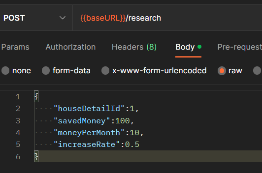

# 프론트 개발을 위한 가이드

> ### 프론트시나리오 설계에 따른 가이드입니다.


상세한 테스트는 POST MAN을 통해 가능합니다!


## 변경된점


기존과 달리 마지막 결과 페이지에서 API 호출이 요구됩니다.\
백엔드 서버로부터 거래내역을 검색하고\
검색된 거래내역을 기반으로 다시 설문조사를 저장합니다.


## 1. 카카오 주소를 이용한 거래내역 검색


[dealhistory-1.md](api-reference/dealhistory/dealhistory-1.md)


프론트에서 사용자가 설문조사를 진행하면 아파트를 검색하는데\
구체적인 주소가 결정되면 도로명+단지명으로 거래내역을 조회합니다.

\[반환 예시]\
거래내역(DealHistory)에는 \[부동산,부동산 상세,거래] 내역이 계층 구조로 되어있습니다.\
"경기 고양시 덕양구 백양로 27 옥빛마을14단지아파트" 이라는 아파트에는\
전용 면적이 50인 상세 내역이 존재하고\
50 면적은 2023-04-01, 2023-04-05 에 거래된 기록이 존재합니다.

```json
{
    "data": {
        "house": {
            "id": 2,
            "jibunAddress": "경기 고양시 덕양구 화정동 1004",
            "roadAddress": "경기 고양시 덕양구 백양로 27",
            "hangCode": 4128112300,
            "danjiName": "옥빛마을14단지아파트",
            "postCode": 10503,
            "latitude": 37.6285682,
            "longitude": 126.8328534,
            "houseDetails": [
                {
                    "id": 2,
                    "count": 0,
                    "dedicatedArea": 50.0,
                    "deals": [
                        {
                            "id": 2,
                            "cost": 31300,
                            "dealDate": "2023-04-01T00:00:00"
                        },
                        {
                            "id": 6,
                            "cost": 30000,
                            "dealDate": "2023-04-05T00:00:00"
                        }
                    ]
                }
            ]
        }
    },
    "message": "거래내역 조회 성공",
    "timestamp": "2023-04-17T20:44:32.568186",
    "errors": null
}
```

기간결조회과 페이지에서는 해당 내역을 바탕으로 결과를 생성할 수 있습니다.

## 2. 거래내역 정보를 통해 설문조사 저장하기

거래내역을 저장하기 위해서는 구체적인 부동산의 주소+면적이 필요합니다.

그래서 위 반환 내역에서 houseDetails의 id 값이 필요합니다. \
(전용면적이 여러개있다면 id도 여러개입니다.)




## 3. 필터링 기능 사용하기

필터링 기능은 이전과 동일하게 위도,경도, 가격을 넣어주면 후보군 아파트들이 반환됩니다.

상세 페이지에서도 기술하였지만\
필터링 결과에 주소가 동일한 경우가 생깁니다.

주소가 동일할 경우 최근 거래된 아파트를 반환합니다.

\[반환 예시]

```json
{
    "data": [
        {
            "roadAddress": "경기 고양시 덕양구 세솔로 25",
            "danjiName": "동산마을 22단지 호반베르디움",
            "cost": 66000,
            "latitude": 37.6463291,
            "longitude": 126.8888416,
            "time": 43,
            "dealDate": "2023-04-03T00:00:00",
            "dedicatedArea": 84.94
        },
        {
            "roadAddress": "경기 고양시 일산서구 강선로 70",
            "danjiName": "강선마을8단지아파트",
            "cost": 53500,
            "latitude": 37.6698493,
            "longitude": 126.7654758,
            "time": 46,
            "dealDate": "2023-04-04T00:00:00",
            "dedicatedArea": 84.99
        },
        {
            "roadAddress": "경기 김포시 고촌읍 고송로 7",
            "danjiName": "김포 고촌 우방아이유쉘",
            "cost": 71000,
            "latitude": 37.6043797,
            "longitude": 126.7675615,
            "time": 44,
            "dealDate": "2023-04-01T00:00:00",
            "dedicatedArea": 149.09
        },
        {
            "roadAddress": "경기 고양시 덕양구 세솔로 105",
            "danjiName": "삼송마을동원로얄듀크",
            "cost": 62000,
            "latitude": 37.6526202,
            "longitude": 126.8873348,
            "time": 44,
            "dealDate": "2023-04-08T00:00:00",
            "dedicatedArea": 84.96
        },
        {
            "roadAddress": "경기 김포시 유현로 200",
            "danjiName": "풍무 푸르지오",
            "cost": 48500,
            "latitude": 37.6096443,
            "longitude": 126.7326057,
            "time": 55,
            "dealDate": "2023-04-01T00:00:00",
            "dedicatedArea": 72.19
        }
    ],
    "message": "거래내역 필터링 성공",
    "timestamp": "2023-04-17T20:33:45.457565",
    "errors": null
}
```
